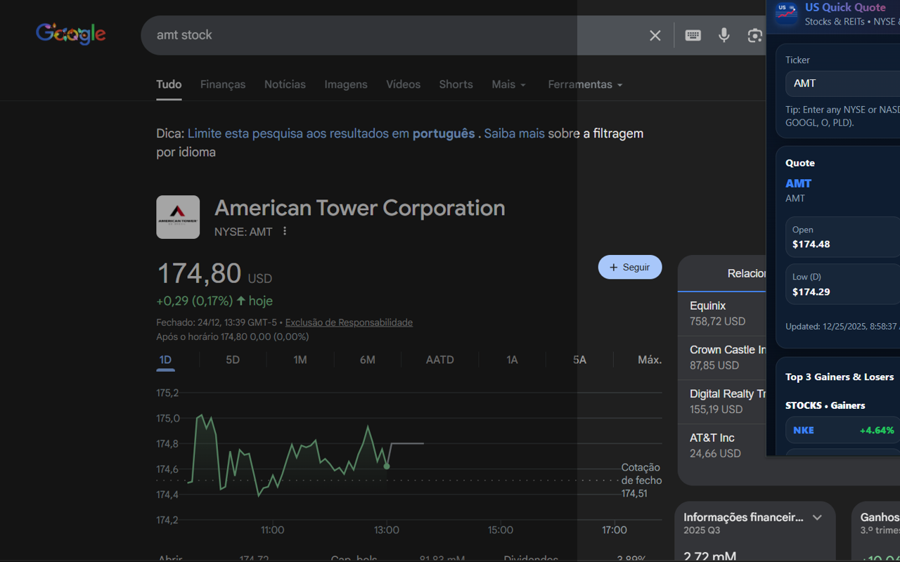

<p align="center">
  
</p>

<h1 align="center">US Quick Quote</h1>

<p align="center">
  <strong>Quick stock and REIT quotes from NYSE & NASDAQ. Right in your browser.</strong>
</p>

<p align="center">
  <a href="#-about">About</a>&nbsp;&nbsp;&nbsp;|&nbsp;&nbsp;&nbsp;
  <a href="#-features">Features</a>&nbsp;&nbsp;&nbsp;|&nbsp;&nbsp;&nbsp;
  <a href="#-installation">Installation</a>&nbsp;&nbsp;&nbsp;|&nbsp;&nbsp;&nbsp;
  <a href="#-how-to-use">How to Use</a>&nbsp;&nbsp;&nbsp;|&nbsp;&nbsp;&nbsp;
  <a href="#-privacy">Privacy</a>
</p>

<p align="center">
  
  
  
  
</p>

---

## 🎯 About

**US Quick Quote** is a Chrome extension that allows you to check stock and REIT quotes from the US market (NYSE & NASDAQ) quickly and easily, without opening heavy websites or logging into trading platforms.

Perfect for investors who want to track the American market efficiently, directly from their browser.

---

## ✨ Features

| Feature | Description |
|---------|-------------|
| 🔍 **Ticker Search** | Enter the stock or REIT code (e.g., AAPL, MSFT, O, PLD) and get the quote instantly |
| 💰 **Real-Time Price** | View current price, percentage change, and change in USD |
| 📊 **Daily Data** | Opening price, day high, day low, and trading volume |
| 📈 **Top 3 Gainers** | See the top 3 biggest gainers of the day for stocks and REITs |
| 📉 **Top 3 Losers** | See the top 3 biggest losers of the day for stocks and REITs |
| 🔄 **Auto Refresh** | Quotes automatically update every 15 seconds |
| 💾 **Last Ticker Memory** | The extension remembers the last asset you searched |
| 🇺🇸 **US Market** | Focused on NYSE & NASDAQ assets |

---

## 📊 Monitored Assets

The extension monitors a curated list of liquid assets for Top 3 calculation:

**Stocks:** AAPL, MSFT, NVDA, AMZN, META, GOOGL, TSLA, BRK.B, JPM, V, MA, UNH, XOM, LLY, AVGO, COST, HD, WMT, PG, KO, PEP, ORCL, ADBE, CRM, CSCO, INTC, AMD, QCOM, NFLX, DIS, BA, NKE, MCD, CAT, GE, T, VZ, PFE, MRK...

**REITs:** O, AMT, PLD, SPG, WELL, VICI, PSA, EQIX, DLR, CCI, AVB, EQR, ESS, INVH, SUI, ARE, BXP, KIM, REG, FRT, NNN, STAG, ADC, SRC, CUBE, EXR, MAA, UDR, HST...

---

## 🚀 Installation

### From Source (Developer Mode)

1. **Clone or download** this repository:
```bash
git clone https://github.com/eltonsantos/us-quick-quote.git
```

2. Open Chrome and go to `chrome://extensions/`

3. Enable **Developer mode** (toggle in the top-right corner)

4. Click **"Load unpacked"** and select the project folder

5. The extension icon will appear in your toolbar — you're ready to go!

---

## 💡 How to Use

1. Click the **US Quick Quote** icon in your Chrome toolbar

2. Enter the asset code in the search field (e.g., `AAPL`, `MSFT`, `O`, `PLD`)

3. Click **Search** or press **Enter**

4. The quote will be displayed with:
   - Current price in USD ($)
   - Percentage and absolute change
   - Opening, high, low, and volume data

5. To see the top gainers and losers of the day, click **Load** in the "Top 3" section

6. Use the **Refresh** button for manual update, or wait for auto-refresh (15s)

---

## 🖼️ Screenshot

<p align="center">
  
</p>

---

## 🧪 Technologies

This extension was built with:

- **JavaScript** (Vanilla JS, no frameworks)
- **Chrome Extensions API** (Manifest V3)
- **CSS3** (Custom styling with CSS variables)
- **Stooq API** (Quote data source - no API key required)
- **Chrome Storage API** (Local preference storage)

---

## 🔒 Privacy

Your privacy matters. This extension:

- ✅ Does **NOT** collect personal data
- ✅ Does **NOT** track your browsing history
- ✅ Does **NOT** send data to external servers (except Stooq for quotes)
- ✅ Works **100% locally** in your browser
- ✅ Only accesses Stooq API to fetch quotes

All settings are stored locally using Chrome Storage.

Read the [full Privacy Policy](PRIVACY.md).

---

## 📋 Changelog

### v1.0.0
- 🎉 Initial release
- Ticker quote search
- Display of price, change, open, high, low, and volume
- Top 3 gainers and losers (Stocks and REITs)
- Auto-refresh every 15 seconds
- Last searched ticker memory

---

## 🐾 Next Steps

- [ ] Publish to Chrome Web Store
- [ ] Add favorites/watchlist feature
- [ ] Price alert notifications
- [ ] Simplified intraday chart
- [ ] Support for more asset types (ETFs, ADRs)
- [ ] Firefox and Edge compatibility

---

## 👨🏻‍💻 Author

<h3 align="center">
  
  <br/>
  <strong>Elton Santos</strong> 🚀
  <br/>
  <br/>

  <a href="https://www.linkedin.com/in/eltonmelosantos" alt="LinkedIn" target="blank">
    
  </a>

  <a href="https://github.com/eltonsantos" alt="GitHub" target="blank">
    
  </a>

  <a href="https://www.youtube.com/@eltonsantosoficial" alt="YouTube" target="blank">
    
  </a>

  <a href="mailto:elton.melo.santos@gmail.com?subject=Hello%20Elton" alt="Email" target="blank">
    
  </a>

  <a href="https://eltonmelosantos.com.br" alt="Website" target="blank">
    
  </a>

<br/>
<br/>

Made with ❤️ by Elton Santos 👋🏽 [Get in touch!](https://www.linkedin.com/in/eltonmelosantos/)

</h3>

---

## 📝 License

This project is licensed under the MIT License - see the [LICENSE](LICENSE) file for details.

---

## ⚠️ Disclaimer

This extension is for informational purposes only. Quotes are obtained from Stooq and may be delayed. It does not constitute investment advice. Always consult a professional before making investment decisions.
